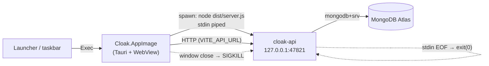

# Local Setup

Running Cloak entirely on your own machine — no cloud compute, no hosting bill. The
desktop app is an AppImage installed under `~/.local`; it starts the API itself on
launch and kills it on close. Only MongoDB Atlas is remote.

> **Tested on Ubuntu 22.04.5 LTS** (kernel 6.8, X11). Everything below was verified on
> that setup. The design is not Linux-specific, but the packaging (AppImage, `.desktop`
> entry, `hicolor` icons) and the process-lifetime tests are.

---

## Architecture



Three deliberate choices, each with a reason:

**The backend is not bundled.** The AppImage contains no server code. It runs
`$CLOAK_API_DIR/dist/server.js` with your system `node`, where `CLOAK_API_DIR` points at
this repo's `api/`. So a backend change is `pnpm build:api` (~5s) and a relaunch — no
AppImage rebuild. Bundling it would have welded every API tweak to a full rebuild.

**No CI.** You build and run on the same machine. A local incremental build is ~35s
warm; a GitHub Actions round trip (queue → cold Rust build → download → install) is
strictly slower and buys nothing for a single-user, single-machine setup.

**AppImage, not deb.** `dpkg -i` needs sudo on every install. An AppImage is a single
file dropped into `~/.local/bin` — no root, and it's the format Tauri's updater can
replace in place if you ever wire one up.

---

## Prerequisites

Verified versions on the test machine:

| Tool | Version | Notes |
|---|---|---|
| Node | v24.15.0 | `engines` requires >=22. Must be on `PATH` for GUI launches. |
| pnpm | 10.33.0 | Pinned via `packageManager` |
| Rust | 1.96.1 | `rust-version = "1.77.2"` is the floor |
| tauri-cli | 2.11.4 | From `devDependencies` |
| `libfuse2` | 2.9.9 | **Required** — AppImage won't run without it |

`libfuse2` ships by default on 22.04. On 24.04+ it was dropped; install
`libfuse2t64` there, or the AppImage fails to mount with no useful error.

---

## One-time setup

1. **Install deps** — `pnpm install` at the repo root.

2. **Configure the API** — create `api/.env` (see `api/.env.example`). At minimum:
   `MONGODB_URI`, `JWT_SECRET`, `REFRESH_SECRET` (both ≥32 chars). `api/src/config/index.ts`
   validates with zod and **exits on startup** if anything is missing, so a typo fails
   loudly rather than at request time.

3. **Lock it down** — `chmod 600 api/.env`. It holds your Atlas URI and both JWT
   secrets. It is gitignored and never enters the AppImage.

4. **Atlas IP allowlist** — your home IP is dynamic, so the allowlist will break on ISP
   renew. Either re-add it when it happens, or use `0.0.0.0/0` and rely on SCRAM auth
   alone. If you want zero cloud, run `mongod` locally and point `MONGODB_URI` at it.

5. **Build and install** — `pnpm ship`.

---

## Daily use

| You changed | Do this | Cost |
|---|---|---|
| Backend only | `pnpm build:api`, relaunch app | ~5s |
| Frontend / Rust | `pnpm ship` | ~35s warm |
| Nothing — just developing | `pnpm dev:api` + `pnpm dev:desktop` | hot reload |

**Dev mode does not use the sidecar.** Debug builds skip the spawn entirely
(`#[cfg(not(debug_assertions))]` in `desktop/src-tauri/src/lib.rs`) so it can't fight
`pnpm dev:api` for the port or cost you tsx's hot reload. Dev talks to `:4000`
(`api.ts` default); the bundled app talks to `:47821`.

`pnpm ship` (`scripts/ship.sh`) builds the API, builds the AppImage, and installs:

- `~/.local/bin/Cloak.AppImage`
- `~/.local/share/applications/cloak.desktop` — the launcher/taskbar entry
- `~/.local/share/icons/hicolor/{128x128,256x256,512x512}/apps/cloak.png`

An AppImage registers nothing on its own, which is why the script writes the desktop
entry. Re-running `ship` replaces the binary; the entry persists.

---

## How the lifecycle works

**Start.** `sidecar::start()` spawns `node dist/server.js` with `cwd` set to `api/` —
that cwd is what makes `dotenv` find `api/.env`, so the backend needs no special
casing. It then blocks until the port accepts a TCP connection (20s timeout). Since
`server.ts` only calls `listen()` after `connectDb()` resolves, an open port means Mongo
is connected too. A backend that dies during startup is surfaced immediately via
`try_wait()` rather than waiting out the timeout.

**Stop, normal.** Closing the window fires `RunEvent::Exit` → `sidecar::stop()` →
`Child::kill()` (SIGKILL) → reaped with `wait()`.

**Stop, abnormal.** If the app is SIGKILLed, no Rust handler runs. The backend's stdin
is a pipe the app holds open purely as a liveness signal — when the app dies, the pipe
EOFs, and `api/src/server.ts` exits. Gated behind `CLOAK_SIDECAR=1` so a terminal or
systemd run is unaffected.

**Ports.** `47821`, fixed and deliberately uncommon so it never collides with a dev
server on 3000/4000/5173. It is defined in two places that must agree:
`sidecar::API_PORT` and `desktop/.env.production`.

**Secrets.** Nothing sensitive is in the bundle. `api/.env` lives outside it, so there's
nothing to extract from the AppImage. (An OS-keyring design was considered and dropped:
its whole rationale was secrets-in-the-artifact, which doesn't apply once the backend
lives outside the bundle.)

**Logs.** `tauri-plugin-log` is registered in release builds too — otherwise the
sidecar, which *only* runs in release, would log into the void and a failed startup
would be silent. Backend stdout/stderr are forwarded into it:

```
~/.local/share/app.cloak.desktop/logs/Cloak.log
```

---

## Issues hit, and how they were resolved

**Orphan guard hung instead of exiting.** The guard fired correctly (the port was
released) but the process never exited. `shutdown()` drains live connections and logs
first — but on parent death the app *was* the only client, and stdout/stderr are pipes
whose reader just died. The `PARENT_EXIT` path now calls `process.exit(0)` directly,
which is also the correct semantic: there is nothing to drain when your only client is
already gone. *Not fully root-caused* — the main thread sat in `futex_wait`, and yama
blocks `ptrace`, so it wasn't strace-able without root. See Known limitations.

**Launcher icon didn't bind to the window.** `StartupWMClass` was `Cloak`; the window's
real `WM_CLASS` is lowercase `cloak` (per `xprop`). A mismatch means the running window
never associates with the desktop entry and falls back to a generic icon.

**`.env.*` was gitignored, including the secret-free build config.**
`desktop/.env.production` holds only the sidecar's localhost URL and is needed for a
reproducible build, so `.gitignore` now has an explicit `!desktop/.env.production`
negation. `api/.env` stays ignored.

**`api/.env` was mode 664** — world-readable, holding the Atlas URI and JWT secrets.
Now `600`.

**Logo read as a dark blob.** The full-colour cloak sits badly on the purple brand
panel and splash tile, so those use the mono mark forced white via
`filter: brightness(0) invert(1)`. The neutral titlebar keeps the colour logo. Shields
that mean "security feature" (2FA bullet, API Keys nav) were left as lucide icons —
only the actual brand marks changed.

---

## Troubleshooting

**Backend won't start.** Check `~/.local/share/app.cloak.desktop/logs/Cloak.log`. Most
likely `CLOAK_API_DIR is not set` (built without `pnpm ship`) or `backend not built`
(run `pnpm build:api`).

**`CLOAK_API_DIR` is baked in at compile time** via `option_env!`, because a GUI launch
never sources a shell profile. `build.rs` has `rerun-if-env-changed` so moving the repo
forces a rebuild. A runtime `CLOAK_API_DIR` env var overrides it if you need to.

**Stale taskbar icon.** Icon caches are stubborn. Log out, or `killall -3 gnome-shell`
on X11.

**Don't debug this with `pkill -f Cloak.AppImage`.** The pattern matches your own shell's
command line, so `pkill` kills itself before killing the app — it looks like the app
survived. Use `pkill -x cloak`, or `pgrep -x cloak` and kill the pid. (This cost real
time during setup and produced a false "orphaned backend" diagnosis.)

**Port already in use.** `ss -ltnp | grep 47821`. A leftover backend means the guard
failed — worth reporting.

---

## Verified behaviour

Tested against the real installed AppImage on Ubuntu 22.04:

| Scenario | Result |
|---|---|
| Launch | backend spawns, listens on 47821, parented to the app |
| Window close | `RunEvent::Exit` → `stopping backend`; backend gone in ~1s, port released |
| `kill -9` the app | stdin EOF → backend gone in ~2s, port released |
| Backend-only change | `pnpm build:api` in 4.7s, no AppImage rebuild |
| `pnpm typecheck` | passes both packages |

---

## Known limitations

- **`pnpm lint` is broken** — `eslint` isn't declared in any `package.json`.
  Pre-existing, unrelated to this setup.
- **The `shutdown()` stall is unexplained.** A plain `SIGTERM` to the sidecar backend
  may hang the same way `PARENT_EXIT` did. The app's own path is unaffected because
  `sidecar::stop()` uses SIGKILL.
- **No auto-update.** `pnpm ship` is manual. Wiring `tauri-plugin-updater` +
  GitHub Releases would work (AppImage is the updatable Linux format) but isn't set up.
- **X11 only, tested.** `StartupWMClass` matching is how X11 binds a window to its
  desktop entry; Wayland uses `app_id` and was not tested.
- **Single machine.** `CLOAK_API_DIR` is an absolute path baked at build time, so the
  installed app depends on this repo staying where it is.
