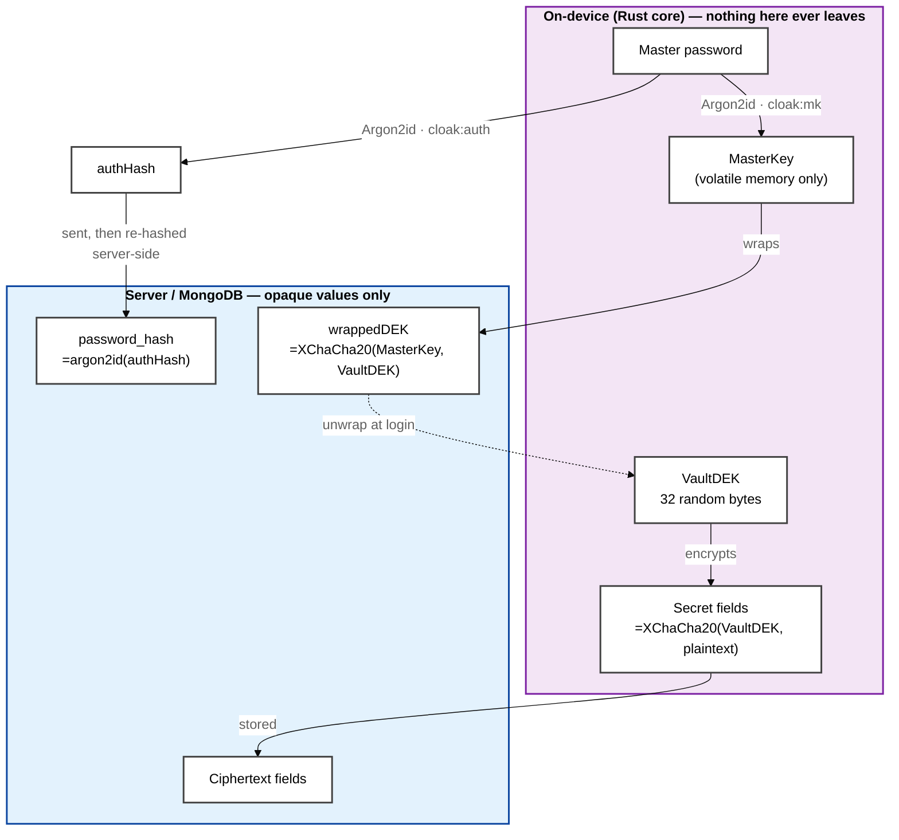
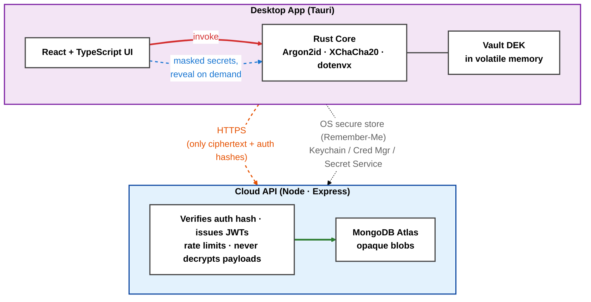
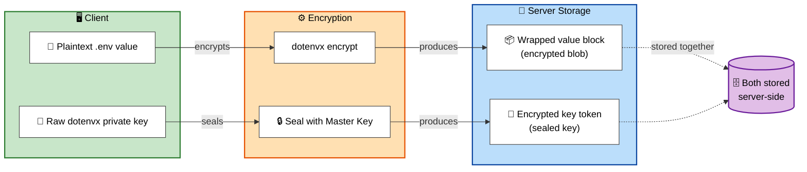

<div align="center">


# Cloak

**A zero-knowledge, developer-centric secrets manager and password vault — built as a native desktop app.**

Your master password and plaintext secrets never leave your machine. Everything is encrypted on-device before it ever touches the network.

<br/>


<br/>

<a href="#-deploy-for-your-team"><b>Deploy for your team</b></a>
&nbsp;·&nbsp;
<a href="#-overview">Overview</a>
&nbsp;·&nbsp;
<a href="#-features">Features</a>
&nbsp;·&nbsp;
<a href="#-how-it-works">How it works</a>
&nbsp;·&nbsp;
<a href="#-tech-stack">Tech stack</a>
&nbsp;·&nbsp;
<a href="#-project-structure">Project structure</a>
&nbsp;·&nbsp;
<a href="#-development-setup">Development setup</a>
&nbsp;·&nbsp;
<a href="#-configuration">Configuration</a>
&nbsp;·&nbsp;
<a href="#-security-model">Security model</a>

</div>

---

##  Overview

**Cloak** is a desktop vault that unifies everyday credential storage with modern developer workflows — most notably encrypted `.env` file management — behind a fast, native-feeling interface.

It is built around a strict **zero-knowledge** contract: all master cryptographic keys are derived locally with Argon2id, secrets are sealed with XChaCha20-Poly1305 before leaving the device, and the cloud API stores only opaque ciphertext it can never read. Secrets are masked by default and revealed strictly on demand, per field.

**What problem it solves**

- Password managers rarely understand developer secrets (`.env` files, API keys, dotenvx-encrypted configs).
- Cloud secret stores require trusting the provider with plaintext.

Cloak keeps the convenience of a synced vault while guaranteeing the server — and anyone who breaches it — only ever sees encrypted blobs.

##  Features

- **Zero-knowledge cryptography** — Argon2id key derivation with domain separation, XChaCha20-Poly1305 field encryption, and envelope encryption of a per-user Vault DEK. Keys live only in volatile memory during a session.
- **Five vault modules** — Credentials, API Keys, Environment Files (`.env`), Backup Codes, and Projects to group them.
- **dotenvx `.env` workflow** — import plaintext or already-encrypted files, then view, decrypt, edit, and delete. Encrypted content is stored server-side as an opaque blob; the dotenvx key is wrapped with your master key.
- **On-demand exposure** — secrets render as truncated ciphertext by default and are decrypted only when you click reveal/copy, conveying real-time decryption.
- **Two-factor auth & email verification** — single-use, time-boxed OTP codes delivered via professionally branded email templates (Resend).
- **Zero-knowledge account recovery** — a Recovery Key + email flow lets you reset a lost master password without the server ever learning your secrets.
- **30-day "Remember Me"** — the master key is provisioned to the OS secure store (macOS Keychain, Windows Credential Manager, Linux Secret Service) via the `keyring` crate.
- **Sandbox mode** — explore the entire app with realistic dummy data, no account required.
- **Functional search & theming** — instant filtering over non-encrypted metadata, plus system/light/dark themes.

##  Deploy for your team

Cloak has no service to sign up for. Your team runs the backend, holds the
database, and keeps the only copies of every key. This section is the whole path
from an empty server to a working team.

You need two things from the [latest release](https://github.com/yousuf-git/cloak/releases/latest):

| Asset | For |
|---|---|
| `Cloak_*.AppImage` / `.deb` / `.rpm` / `.msi` / `.dmg` | Everyone, one per person |
| `cloak-server-v*.zip` | The person running the server, once |

### 1. Set up the server

On any machine your team can reach — an EC2 instance, a droplet, a box in the
office. It needs Node 22+ or Docker, and a MongoDB you control.

```bash
unzip cloak-server-v0.2.0.zip && cd cloak-server-v0.2.0
./setup.sh
```

`setup.sh` writes `.env` with cryptographically random values already filled in
for `JWT_SECRET`, `REFRESH_SECRET`, `OWNERSHIP_KEY` and `HEALTH_TOKEN` — 384 bits
each from the system CSPRNG, so nobody has to invent a secret — and prints the
ownership key once. **Copy it somewhere safe now.** Everything else in `.env` is
documented inline; two entries need you:

| Variable | What to put there |
|---|---|
| `MONGODB_URI` | Your database. Leave blank when using `docker-compose.yml`, which supplies its own MongoDB. |
| `PUBLIC_URL` | The address teammates will reach this server on, exactly as they would type it. This is baked into invitation join keys, so a wrong value here means nobody can connect. |

Optionally set `RESEND_API_KEY` and `RESEND_FROM_EMAIL`. Without them the server
still works — verification codes and invitations are written to the server log
and the app shows invitations for you to pass along by hand — but delivering
them by email is far less friction.

Then start it, with or without Docker:

```bash
docker compose up -d                                # Docker
npm ci --omit=dev && npm start                      # pm2 or systemd
pm2 start ecosystem.config.cjs && pm2 save          # ...under pm2
```

For a public host, put TLS in front. The Caddy overlay obtains and renews a
certificate on its own once DNS points at the machine:

```bash
CLOAK_DOMAIN=vault.example.com \
  docker compose -f docker-compose.yml -f docker-compose.tls.yml up -d
```

> **Plain HTTP is only safe where it cannot cross an untrusted network.** Vault
> contents are encrypted on each device either way, but session tokens are not.
> The desktop app refuses `http://` unless the host is loopback, a private LAN
> range, or Tailscale's `100.64/10`. Everything else needs TLS.

### 2. Check it

Open `PUBLIC_URL` in a browser for a live status page that refreshes itself.

The public view shows only whether the server is up and whether anyone owns it
yet. Append `?key=<HEALTH_TOKEN>` — the value `setup.sh` generated — for database
name and connection state, record counts, the Resend key masked, uptime and
memory. Owners see the same detail inside the app without handling the token.
`GET /status.json` returns the same two tiers as JSON.

### 3. Take ownership

Install the desktop app. Its first screen asks for a server, not a password.

Enter your address. The app checks that it is a Cloak server, that it speaks the
same API version, and that its database and mail are healthy — and says exactly
what is wrong and how to fix it if not. Since nobody owns this server yet, it
then asks for the ownership key.

Enter it and sign up as normal: name, email, master password, verification code,
recovery keys. Two things happen when that account is created:

- The ownership key is spent. It is verified before signup and consumed
  atomically as the account is written, so a failed signup leaves it usable and
  a completed one closes the ownership flow permanently.
- The server becomes invite-only. Any address without a pending invitation is
  refused from then on, so an exposed server cannot be joined by whoever finds it.

Remove `OWNERSHIP_KEY` from `.env` afterwards. Re-opening the ownership flow
requires a wiped database and a redeploy.

### 4. Add your team

Invite from **Team → Invite**. Each invitation produces a **join key**: one
string that names your server and carries the invitation token.

That solves the problem every self-hosted tool has — how a new person learns
which server to talk to. They never type an address. They install Cloak, paste
the join key into the first screen, and the app connects to the right server and
redeems the invitation in one step. If mail is configured the key is emailed; if
not, the app shows it for you to send over a channel you trust. Either way it is
addressed to one email address and expires, so a leaked key admits nobody else.

Then comes the step that makes this zero-knowledge rather than merely private:

**Joining grants nothing.** A new member can see the organization and read
nothing in it. An existing member has to seal the organization's key to their
device — an operation that happens on the granting member's machine, using a key
the server has never held. Until someone does that, the vault stays closed to
them.

Before granting, the app shows the new member's key fingerprint. **Read it back
to them over a call or in person.** It is the only defence against a
compromised server substituting its own key and receiving the organization's key
sealed to it. On your own hardware that risk is small, but it is not zero.

### Operating notes

- **Back up MongoDB.** It holds the only copy of every wrapped key. Losing it
  loses every vault, and no support path can recover them — that is the design,
  not a gap in it.
- **Run one API instance.** Rate-limit counters live in process memory, so a
  second worker silently doubles every limit. `ecosystem.config.cjs` pins pm2 to
  one for this reason.
- **Rotating `JWT_SECRET` or `REFRESH_SECRET`** signs everyone out. Nothing is
  lost; everyone signs in again.
- **Removing a member does not rotate the organization's key.** They lose server
  access immediately, but anything they already decrypted stays readable to them.
  See [`docs/TEAMS_ARCHITECTURE.md`](docs/TEAMS_ARCHITECTURE.md).

##  How it works

Cloak splits responsibilities between an on-device Rust core (all cryptography) and a thin cloud API (opaque storage + auth orchestration).

### Zero-Knowledge by Construction

Zero-knowledge here is not a policy — it falls out of the key hierarchy. Every key that can decrypt anything is derived or generated **on-device**, and only wrapped (encrypted) forms ever reach the server:



The same password produces two independent keys via Argon2id **domain separation**:

- **MasterKey** (`cloak:mk` context) — wraps the Vault DEK. Exists only in Rust process memory; never stored, never transmitted.
- **authHash** (`cloak:auth` context) — sent to the server purely to prove identity. The server Argon2id-hashes it *again* before storage, so even a full database leak yields no replayable credential — and the authHash cannot be reversed into the MasterKey.

The **Vault DEK** — a random 256-bit key that actually encrypts every secret field (by XChaCha20-Poly1305) — is stored only as `wrappedDEK`, sealed under the MasterKey. At login the client re-derives the MasterKey locally, unwraps the DEK in Rust memory, and the webview only ever handles ciphertext strings plus transiently revealed plaintext. Raw key bytes never cross the webview boundary, let alone the network.

What this means concretely for someone with **full read access to the database**:

| They get | They can do with it |
|----------|---------------------|
| `password_hash` = argon2id(authHash) | Nothing — a one-way hash of an already-derived value; not the password, not a login token |
| `wrappedDEK`, `recovery_wrappedDEK` | Nothing without the master password or recovery key — opaque XChaCha20-Poly1305 blobs |
| Secret fields (`password`, `key`, `.env` content) | Nothing — ciphertext under the DEK they cannot unwrap |
| `crypto_salt`, emails, names/labels/URLs | Read searchable metadata only — by design, this powers instant client-side search |

Account recovery keeps the same guarantee: the DEK is additionally wrapped under a key derived from a 160-bit recovery key shown once at signup, so a password reset unwraps and re-wraps 32 bytes client-side — the server rotates envelopes it still cannot open, and existing ciphertext stays valid.

For the full code-traced walkthrough — every flow from keystroke to MongoDB document with `file:line` references — see [`docs/CORE_LOGICS.md`](./docs/CORE_LOGICS.md).

### Desktop App Architecture



### Dotenvx Encryption Process

Values are encrypted individually, and the private key that unlocks them is itself sealed with your master key. Both the encrypted blob and the sealed key are stored server-side.



##  Tech Stack

| Layer | Technologies |
|-------|--------------|
| **Desktop shell** | Tauri 2, Rust (2021 edition) |
| **Rust crypto core** | `argon2`, `chacha20poly1305`, `dotenvx`, `zeroize`, `keyring` |
| **Frontend** | React 19 (compiler), TypeScript, Vite, Tailwind CSS v4 |
| **State & data** | TanStack Query, Zustand, React Hook Form + Zod, Framer Motion |
| **Cloud API** | Node.js (≥22), Express 5, Mongoose / MongoDB Atlas, Zod, Pino |
| **Auth & email** | JWT (access + rotating refresh), Argon2id, Resend |
| **Tooling** | pnpm workspaces, Vitest, ESLint |

##  Project Structure

```
cloak/
├── api/                     # Cloud backend (Node + Express + MongoDB)
│   ├── src/
│   │   ├── config/          # Zod-validated environment config
│   │   ├── controllers/     # Auth + vault request handlers
│   │   ├── services/        # Auth, vault, env-file, email, token, audit logic
│   │   ├── models/          # Mongoose schemas (user, cred, api-key, env-file, …)
│   │   ├── middlewares/     # Rate limiting, auth guard, logging, error handling
│   │   ├── routes/          # Versioned API routes (/api/v1)
│   │   └── lib/             # jwt, hashing, logger, email-templates, errors
│   └── tests/               # Vitest + Supertest integration tests
│
└── desktop/                 # Tauri desktop application
    ├── src/                 # React + TypeScript UI
    │   ├── pages/           # Credentials, API keys, Env files, Backup codes, Projects, Settings
    │   ├── components/      # Auth flows, vault UI, shared primitives
    │   ├── hooks/ stores/   # Data hooks + Zustand stores (auth, sandbox, search, theme)
    │   └── lib/             # API client, tauri-crypto bridge, env parser
    └── src-tauri/           # Rust core
        └── src/
            ├── crypto/      # kdf, aead, dek, dotenvx_compat
            ├── commands/    # Tauri commands exposed to the webview
            ├── keystore/    # OS secure-store (Remember-Me)
            └── session/     # In-memory session + Vault DEK
```

##  Development setup

### Prerequisites

- **Node.js** ≥ 22 and **pnpm** 10.33 (`corepack enable`)
- **Rust** toolchain ≥ 1.77 (via [rustup](https://rustup.rs))
- **MongoDB** running locally or a MongoDB Atlas connection string
- Tauri platform dependencies for your OS — see the [Tauri prerequisites guide](https://tauri.app/start/prerequisites/)

### Installation

```bash
git clone https://github.com/yousuf-git/cloak.git
cd cloak
pnpm install
```

### Configure the API

```bash
cp api/.env.example api/.env
```

Then set at least `MONGODB_URI`, `JWT_SECRET`, and `REFRESH_SECRET` (each ≥ 32 characters). See the **Configuration** section below for the full list.

### Run in development

```bash
# Terminal 1 — cloud API (http://localhost:4000)
pnpm dev:api

# Terminal 2 — desktop app (Tauri window + Vite on http://localhost:1420)
pnpm --filter @cloak/desktop tauri:dev
```

On first launch the app asks which server to connect to — enter `http://localhost:4000`. The choice is saved, so later launches go straight to sign-in.

> Prefer a quick look without native tooling? `pnpm dev:desktop:ui` runs the UI in the browser, and the in-app **Sandbox** button lets you explore with dummy data — no API or account needed.

> Running the whole thing on one machine as a single user, with the app starting its own backend? That is a separate setup, documented in [`LOCAL_SETUP.md`](LOCAL_SETUP.md). It is not how you deploy for a team — use [Deploy for your team](#-deploy-for-your-team) for that.

### Build for production

```bash
pnpm build:api                              # compile the API to dist/
pnpm --filter @cloak/desktop tauri:build    # produce a native desktop bundle
```

##  Configuration

API configuration is validated at boot with Zod (`api/src/config/index.ts`) — the server refuses to start on invalid config. A variable present but empty counts as unset, so blank optional entries in a generated `.env` are fine.

| Variable | Required | Default | Description |
|----------|:--------:|---------|-------------|
| `NODE_ENV` | – | `development` | `development` \| `test` \| `production` |
| `PORT` | – | `4000` | API listen port |
| `MONGODB_URI` | **Yes** | – | MongoDB connection string |
| `JWT_SECRET` | **Yes** | – | Access-token signing secret (≥ 32 chars) |
| `REFRESH_SECRET` | **Yes** | – | Refresh-token signing secret (≥ 32 chars) |
| `PUBLIC_URL` | Deploy | – | Address teammates reach this server on. Baked into invitation join keys |
| `OWNERSHIP_KEY` | Fresh DB | – | Claims a new deployment; spent when the first owner account is created |
| `HEALTH_TOKEN` | – | – | Unlocks the detailed status page at `/?key=…` for a browser with no session |
| `SERVER_NAME` | – | `Cloak Server` | Shown on the status page and the app's connect screen |
| `ACCESS_TOKEN_TTL` | – | `15m` | Access-token lifetime |
| `REFRESH_TOKEN_TTL` | – | `30d` | Refresh-token lifetime |
| `OTP_TTL_SECONDS` | – | `600` | One-time code lifetime (seconds) |
| `RATE_LIMIT_WINDOW_MS` | – | `900000` | Rate-limit window (15 min) |
| `RATE_LIMIT_AUTH_MAX` | – | `10` | Max failed auth attempts per window |
| `RATE_LIMIT_API_MAX` | – | `100` | Max API requests per window |
| `RATE_LIMIT_UPLOAD_MAX` | – | `20` | Max uploads per window |
| `CORS_ORIGIN` | – | `*` | Allowed origin(s), comma-separated |
| `LOG_LEVEL` | – | `info` | Pino log level |
| `RESEND_API_KEY` | – | – | Enables real email delivery (else logged to console) |
| `RESEND_FROM_EMAIL` | – | – | Verified sender address for Resend |
| `AUDIT_RETENTION_DAYS` | – | `365` | Audit-log TTL. Changing it rebuilds the index |

`setup.sh` in the server bundle generates `JWT_SECRET`, `REFRESH_SECRET`, `OWNERSHIP_KEY` and `HEALTH_TOKEN` for you.

##  Scripts

Run from the repository root:

| Command | Description |
|---------|-------------|
| `pnpm dev:api` | Start the API in watch mode |
| `pnpm dev:desktop` | Start the desktop UI (browser preview) |
| `pnpm build:api` | Compile the API to `dist/` |
| `pnpm build:desktop` | Build the desktop frontend |
| `pnpm test` | Run all workspace tests |
| `pnpm typecheck` | Type-check every package |
| `pnpm lint` | Lint every package |

Desktop-only: `pnpm --filter @cloak/desktop tauri:dev` and `… tauri:build`.

##  Testing

The API ships with Vitest + Supertest integration tests covering health, authentication/recovery, and vault CRUD.

```bash
pnpm --filter @cloak/api test     # API integration suite
pnpm test                         # all workspaces
```

##  Security Model

- **Plaintext never leaves the device.** The master key is derived locally and held only in volatile memory; the server stores opaque ciphertext and authentication hashes.
- **Envelope encryption.** A per-user Vault DEK is wrapped by the master key (and by a recovery-wrapping key), so a password reset re-wraps keys without exposing data.
- **No secrets in logs.** Structured logging redacts tokens, hashes, and secret payloads; request logs are trimmed to method/URL/status.
- **Hardened transport & rate limits.** Tiered `express-rate-limit` windows and Helmet headers guard the API; auth attempts are strictly capped.
- **Metadata-only search.** Search filters non-encrypted fields (names, labels, tags) so browsing never triggers bulk decryption.

> Cloak is under active development and has not undergone an independent security audit. Review the threat model before using it for production secrets.

##  License

Released under the [MIT License](./LICENSE).
