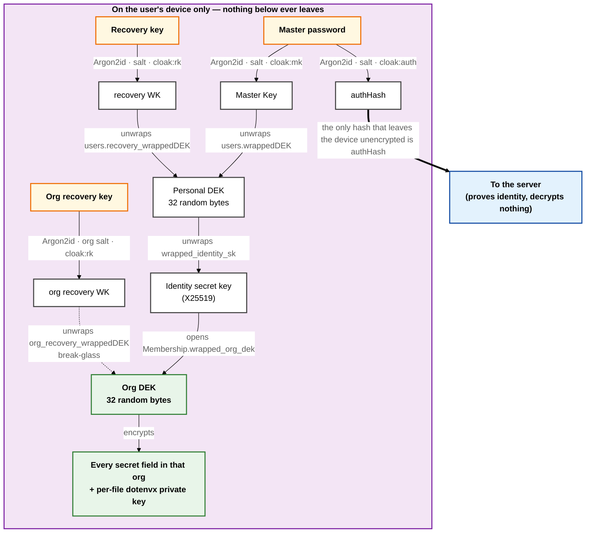

# Cloak — Info About Keys

> Every key, secret, token and salt in Cloak: what it is, how it is produced, where it is stored,
> whether it is stored in the clear or encrypted, and who is able to read it.
>
> This is a **reference catalogue**. For the narrative version — how a secret travels through the
> app end to end — read [`CORE_LOGICS.md`](./CORE_LOGICS.md). For the multi-user model, read
> [`TEAMS_ARCHITECTURE.md`](./TEAMS_ARCHITECTURE.md). Where those documents and this one disagree,
> the code is authoritative and this document is traced to it with `file:line` links.

---

## Contents

1. [Vocabulary: wrap, seal, hash, derive](#1-vocabulary-wrap-seal-hash-derive)
2. [The key hierarchy at a glance](#2-the-key-hierarchy-at-a-glance)
3. [The cryptographic primitives](#3-the-cryptographic-primitives)
4. [Master catalogue — every key in one table](#4-master-catalogue--every-key-in-one-table)
5. [Account keys](#5-account-keys)
6. [Identity keys](#6-identity-keys)
7. [Organization keys](#7-organization-keys)
8. [`.env` file keys (dotenvx)](#8-env-file-keys-dotenvx)
9. [Encrypted payload fields](#9-encrypted-payload-fields)
10. [Session and transport tokens](#10-session-and-transport-tokens)
11. [Server deployment secrets](#11-server-deployment-secrets)
12. [Export and backup keys](#12-export-and-backup-keys)
13. [Remember-Me and the OS keychain](#13-remember-me-and-the-os-keychain)
14. [Sandbox mode is not encryption](#14-sandbox-mode-is-not-encryption)
15. [Where everything is stored — by location](#15-where-everything-is-stored--by-location)
16. [Key lifecycle events](#16-key-lifecycle-events)
17. [Loss matrix — what happens if you lose X](#17-loss-matrix--what-happens-if-you-lose-x)
18. [Known weaknesses](#18-known-weaknesses)
19. [File map](#19-file-map)

---

## 1. Vocabulary: wrap, seal, hash, derive

Four verbs are used precisely throughout this document and the codebase. Confusing them makes the
rest unreadable.

| Verb | Means | Primitive | Reversible by |
|------|-------|-----------|---------------|
| **derive** | turn a human secret into key bytes | Argon2id | anyone with the same input + salt |
| **wrap** | symmetrically encrypt one key with another key | XChaCha20-Poly1305 | holder of the wrapping key |
| **seal** | asymmetrically encrypt to a recipient's public key | X25519 sealed box | holder of the matching secret key |
| **hash** | one-way fingerprint, for verification only | Argon2id or SHA-256 | nobody — you can only re-hash and compare |

"Encrypted" in this document always means *reversible with the right key*. "Hashed" always means
*not reversible at all*.

---

## 2. The key hierarchy at a glance



Three human secrets enter at the top (amber). Everything they unlock stays inside the box. The single
thick arrow leaving is the authHash, which proves who you are and decrypts nothing. The dashed arrow
is the org break-glass path — a second, independent door into the same Org DEK.

Read it as a chain of locks. Each level unlocks exactly the next one, and only the bottom level —
the Org DEK — ever touches your actual data. That is why changing your password is cheap: it
re-wraps 32 bytes, it does not re-encrypt the vault.

The **personal DEK no longer encrypts vault data** since teams landed. Its only remaining job is
wrapping the identity secret key ([`TEAMS_ARCHITECTURE.md`](./TEAMS_ARCHITECTURE.md)).

---

## 3. The cryptographic primitives

### 3.1 Argon2id — the KDF

[`crypto/kdf.rs:22`](../desktop/src-tauri/src/crypto/kdf.rs#L22)

| Parameter | Value |
|-----------|-------|
| Algorithm | Argon2id, version 0x13 |
| Memory cost | 19 456 KiB (19 MiB) |
| Time cost | 2 passes |
| Parallelism | 1 lane |
| Output | 32 bytes |
| Salt | 16 random bytes, base64, minimum 16 enforced at [`kdf.rs:31`](../desktop/src-tauri/src/crypto/kdf.rs#L31) |

Three domains are derived from the same password and salt, separated by a label that is passed as
**Argon2's secret input** ([`kdf.rs:22`](../desktop/src-tauri/src/crypto/kdf.rs#L22)):

| Domain | Label | Produces |
|--------|-------|----------|
| Master key | `cloak:mk` | the key that wraps the personal DEK |
| Auth hash | `cloak:auth` | the credential sent to the server |
| Recovery | `cloak:rk` | the key that wraps the recovery envelope |

Each domain is therefore a distinct **keyed** Argon2id hash, and the three outputs are
computationally independent. This matters more than it looks: the authHash is handed to the server on
every login, so if the domains were merely mixed into a shared Argon2 output, anyone holding an
authHash could reconstruct the Master Key and open the vault. The regression test at
[`kdf.rs`](../desktop/src-tauri/src/crypto/kdf.rs) (`master_key_is_not_recoverable_from_auth_hash`)
pins that property by checking `MasterKey XOR authHash` is not the same value for two different
passwords.

### 3.2 XChaCha20-Poly1305 — the field cipher

[`crypto/aead.rs`](../desktop/src-tauri/src/crypto/aead.rs)

Used for every symmetric operation in the app: wrapping DEKs, wrapping the identity secret key,
wrapping dotenvx private keys, and encrypting every secret field.

```
seal(key, plaintext):
    nonce  = 24 random bytes                       # aead.rs:18
    ct‖tag = XChaCha20Poly1305(key, nonce, plaintext)
    output = base64( nonce ‖ ct ‖ tag )            # aead.rs:26
```

Every stored ciphertext in Cloak has this exact shape. A fresh random nonce per call means the same
plaintext encrypts to a different string every save. The 16-byte Poly1305 tag means tampering is
detected, not silently decrypted into garbage.

### 3.3 X25519 sealed box — the sharing primitive

[`crypto/identity.rs`](../desktop/src-tauri/src/crypto/identity.rs), via the `crypto_box` crate
(libsodium's anonymous sealed-box construction: X25519 + XSalsa20-Poly1305).

The sender needs **no keypair of their own**. That is the whole point: an admin can seal the Org DEK
to a joining member's public key without any prior key exchange, and cannot read the result back
afterwards. The server can never perform this operation — it holds public keys and opaque blobs only.

### 3.4 ECIES over secp256k1 — the `.env` cipher

[`crypto/dotenvx_compat.rs`](../desktop/src-tauri/src/crypto/dotenvx_compat.rs), wrapping the
`dotenvx` crate. Used **only** for `.env` file values, so that Cloak's output is byte-compatible with
the real `dotenvx` CLI and can be decrypted outside Cloak entirely.

### 3.5 PBKDF2-SHA256 + AES-256-GCM — portable backups

[`lib/vault-export.ts:79`](../desktop/src/lib/vault-export.ts#L79). Used only for the `.cloak`
export envelope, which is deliberately independent of the vault DEK so it can be opened on any
device. 210 000 iterations ([`vault-export.ts:35`](../desktop/src/lib/vault-export.ts#L35)).

### 3.6 SHA-256 — token fingerprints

[`lib/hashing.ts:22`](../api/src/lib/hashing.ts#L22). Server-side only, for high-entropy values
where a slow KDF would be pointless: refresh tokens, invitation tokens, OTP codes, the ownership key.

---

## 4. Master catalogue — every key in one table

`Location` says where the value comes to rest. `Form` says whether it is readable there.

| # | Key / secret | Bytes / shape | Produced by | Location | Form |
|---|--------------|---------------|-------------|----------|------|
| 1 | `crypto_salt` | 16 rand → base64 | [`kdf.rs:58`](../desktop/src-tauri/src/crypto/kdf.rs#L58) | MongoDB `users.crypto_salt` | **plaintext** (public by design) |
| 2 | Master Key | 32 | Argon2id `cloak:mk` | Rust process memory | plaintext in RAM, zeroized on clear |
| 3 | authHash | 32 → base64 | Argon2id `cloak:auth` | transient — request body | **plaintext on the wire** |
| 4 | `password_hash` | Argon2id encoded string | [`hashing.ts:9`](../api/src/lib/hashing.ts#L9) | MongoDB `users.password_hash` | one-way hash |
| 5 | personal DEK | 32 rand | [`dek.rs:8`](../desktop/src-tauri/src/crypto/dek.rs#L8) | Rust memory; OS keychain if Remember-Me | plaintext in RAM / keychain |
| 6 | `wrappedDEK` | base64 | `XChaCha20(MasterKey, DEK)` | MongoDB `users.wrappedDEK` | encrypted |
| 7 | account recovery key | 160-bit Crockford base32 | [`kdf.rs:93`](../desktop/src-tauri/src/crypto/kdf.rs#L93) | **shown once on screen, then gone** | never stored anywhere |
| 8 | `recovery_wrappedDEK` | base64 | `XChaCha20(recoveryWK, DEK)` | MongoDB `users.recovery_wrappedDEK` | encrypted |
| 9 | identity public key | 32 X25519 → base64 | [`identity.rs:19`](../desktop/src-tauri/src/crypto/identity.rs#L19) | MongoDB `users.identity_public_key` | **plaintext** (public by design) |
| 10 | identity secret key | 32 X25519 | [`identity.rs:19`](../desktop/src-tauri/src/crypto/identity.rs#L19) | Rust memory | plaintext in RAM |
| 11 | `wrapped_identity_sk` | base64 | `XChaCha20(personalDEK, sk)` | MongoDB `users.wrapped_identity_sk` | encrypted |
| 12 | Org DEK | 32 rand | [`dek.rs:8`](../desktop/src-tauri/src/crypto/dek.rs#L8) | Rust memory, per unlocked org | plaintext in RAM |
| 13 | `wrapped_org_dek` | base64 | `sealed_box(member pubkey, OrgDEK)` | MongoDB `memberships.wrapped_org_dek` | encrypted, one row per member |
| 14 | org recovery key | 160-bit Crockford base32 | [`kdf.rs:93`](../desktop/src-tauri/src/crypto/kdf.rs#L93) | **shown once on screen, then gone** | never stored anywhere |
| 15 | `org_recovery_salt` | 16 rand → base64 | [`kdf.rs:58`](../desktop/src-tauri/src/crypto/kdf.rs#L58) | MongoDB `orgs.org_recovery_salt` | **plaintext** (public by design) |
| 16 | `org_recovery_wrappedDEK` | base64 | `XChaCha20(orgRecoveryWK, OrgDEK)` | MongoDB `orgs.org_recovery_wrappedDEK` | encrypted |
| 17 | dotenvx public key | secp256k1, hex | [`dotenvx_compat.rs:13`](../desktop/src-tauri/src/crypto/dotenvx_compat.rs#L13) | inside the `.env` blob as `DOTENV_PUBLIC_KEY` | **plaintext** (public by design) |
| 18 | dotenvx private key | secp256k1, hex | [`dotenvx_compat.rs:13`](../desktop/src-tauri/src/crypto/dotenvx_compat.rs#L13) | MongoDB `env-files.encrypted_dotenvx_key` | encrypted under the Org DEK |
| 19 | secret payload fields | base64 | `XChaCha20(OrgDEK, value)` | MongoDB, per collection ([§9](#9-encrypted-payload-fields)) | encrypted |
| 20 | access token (JWT) | JWT, 15 min | [`jwt.ts:12`](../api/src/lib/jwt.ts#L12) | webview memory only | signed, not encrypted |
| 21 | refresh token | 32 rand → base64url | [`hashing.ts:33`](../api/src/lib/hashing.ts#L33) | webview memory; OS keychain if Remember-Me | plaintext where held |
| 22 | `refresh_tokens.token_hash` | SHA-256 hex | [`token.service.ts:67`](../api/src/services/token.service.ts#L67) | MongoDB | one-way hash |
| 23 | OTP code | 6 digits | [`hashing.ts:38`](../api/src/lib/hashing.ts#L38) | emailed to the user | plaintext in the email |
| 24 | `otps.code_hash` | SHA-256 hex | [`otp.service.ts:18`](../api/src/services/otp.service.ts#L18) | MongoDB, TTL-expired | one-way hash |
| 25 | invitation token | 32 rand → base64url | [`hashing.ts:33`](../api/src/lib/hashing.ts#L33) | emailed, wrapped in a join key | plaintext in the email |
| 26 | `invitations.token_hash` | SHA-256 hex | [`invitation.model.ts`](../api/src/models/invitation.model.ts) | MongoDB, TTL-expired | one-way hash |
| 27 | join key (`cloak_…`) | base64url JSON | [`join-key.ts:15`](../api/src/lib/join-key.ts#L15) | emailed | **encoding, not encryption** |
| 28 | recovery JWT | JWT, 10 min | [`jwt.ts:28`](../api/src/lib/jwt.ts#L28) | webview memory | signed, not encrypted |
| 29 | `JWT_SECRET` | 48 rand → base64url | [`setup.sh:48`](../api/setup.sh#L48) | server `.env` | **plaintext on the server host** |
| 30 | `REFRESH_SECRET` | 48 rand → base64url | [`setup.sh:49`](../api/setup.sh#L49) | server `.env` | **plaintext, and currently unused** ([§18.1](#181-refresh_secret-is-required-but-never-used)) |
| 31 | `OWNERSHIP_KEY` | 32 rand → base64url | [`setup.sh:50`](../api/setup.sh#L50) | server `.env`, then spent | plaintext in `.env`; SHA-256 in MongoDB |
| 32 | `HEALTH_TOKEN` | 32 rand → base64url | [`setup.sh:51`](../api/setup.sh#L51) | server `.env` | plaintext, compared directly |
| 33 | `.cloak` backup passphrase | user-chosen | user | never stored | PBKDF2 → AES-GCM envelope |
| 34 | sandbox "ciphertext" | base64 | [`sandbox-cipher.ts:10`](../desktop/src/lib/sandbox-cipher.ts#L10) | webview memory only | **not encrypted at all** ([§14](#14-sandbox-mode-is-not-encryption)) |

---

## 5. Account keys

### 5.1 `crypto_salt` — public, and meant to be

16 random bytes, base64-encoded, generated once at signup
([`kdf.rs:58`](../desktop/src-tauri/src/crypto/kdf.rs#L58)) and stored in the clear on the user
document. The login endpoint hands it back to any client that asks for a given email, before
authentication — it has to, because the client cannot derive its auth hash without it.

A salt is not a secret. Its job is to make precomputed rainbow tables useless by ensuring two users
with the same password derive different keys. Treat a leaked salt as a non-event.

The salt is **rotated on every password change and every recovery reset**
([`commands/crypto.rs:150`](../desktop/src-tauri/src/commands/crypto.rs#L150)), which is why both
envelopes have to be rebuilt at once.

### 5.2 Master Key — never stored, never transmitted

32 bytes, `Argon2id(password, crypto_salt, secret="cloak:mk")`. It exists only inside the Rust process
([`session/mod.rs:19`](../desktop/src-tauri/src/session/mod.rs#L19)), wrapped in `Zeroizing` so it is
scrubbed from memory when dropped, and it is cleared on logout
([`session/mod.rs:86`](../desktop/src-tauri/src/session/mod.rs#L86)).

It never crosses the Tauri boundary into the webview, is never written to disk, and is never sent to
the server. Its **only** job is wrapping and unwrapping the personal DEK.

### 5.3 authHash — the credential the server actually sees

32 bytes, `Argon2id(password, crypto_salt, secret="cloak:auth")`, base64-encoded, sent in the request
body on signup, login and recovery reset ([`auth.validators.ts:12`](../api/src/validators/auth.validators.ts#L12)).

The intent is that the raw password never reaches the server, and that the stored credential is not
replayable: the server hashes the authHash *again* with a per-record Argon2id salt before storing it
as `password_hash` ([`hashing.ts:9`](../api/src/lib/hashing.ts#L9)), and verifies with
`argon2.verify` ([`hashing.ts:13`](../api/src/lib/hashing.ts#L13)).

The authHash is on the logger's redaction list ([`logger.ts:16`](../api/src/lib/logger.ts#L16)) so it
cannot land in application logs.

The authHash and the Master Key come from independent keyed derivations
([§3.1](#31-argon2id--the-kdf)), so possessing the authHash reveals nothing about the Master Key and
cannot be used to unwrap the DEK. That independence is the hinge of the whole zero-knowledge claim —
it is what makes it safe to send this value to a server you do not fully trust.

### 5.4 `password_hash` — server-side only

`argon2id(authHash)` with the library's default parameters and its own embedded salt. Stored on the
user document. Not encrypted, but not reversible either, and not a replayable login token — an
attacker with a database dump still needs to find a preimage that Argon2-verifies.

### 5.5 Personal DEK — 32 random bytes, two envelopes

Generated at signup with the OS CSPRNG ([`dek.rs:8`](../desktop/src-tauri/src/crypto/dek.rs#L8)). It
is **never stored in usable form on the server**. Two independent wrapped copies exist:

| Envelope | Wrapping key | DB field |
|----------|--------------|----------|
| Everyday | Master Key (from your password) | `users.wrappedDEK` |
| Break-glass | recovery WK (from your recovery key) | `users.recovery_wrappedDEK` |

Both envelopes hold the *same* 32 bytes. That is what makes recovery possible without the server
knowing anything, and what makes a password change cheap — you re-wrap 32 bytes, you never
re-encrypt the vault.

Since teams, the personal DEK's only remaining job is wrapping the identity secret key. Vault fields
are encrypted under the **Org** DEK.

The DEK can be exported as base64 — but only inside Rust
([`session/mod.rs:101`](../desktop/src-tauri/src/session/mod.rs#L101)), for writing to the OS
keychain. It never reaches JavaScript.

### 5.6 Account recovery key — shown once, stored nowhere

160 bits of entropy formatted as 8 groups of 4 Crockford base32 characters
(`XXXX-XXXX-XXXX-XXXX-XXXX-XXXX-XXXX-XXXX`), generated at
[`kdf.rs:93`](../desktop/src-tauri/src/crypto/kdf.rs#L93).

Crockford's alphabet omits `I`, `L`, `O` and `U`, and the normalizer
([`kdf.rs:79`](../desktop/src-tauri/src/crypto/kdf.rs#L79)) folds `O→0`, `I/L→1`, `U→V`, uppercases,
and strips every separator. A user can retype it lowercase, with spaces instead of hyphens, and it
still matches.

It is displayed exactly once, immediately after signup, and held in the auth store only until the
user dismisses the screen ([`stores/auth.ts:193`](../desktop/src/stores/auth.ts#L193), cleared at
[`:222`](../desktop/src/stores/auth.ts#L222)). **Nothing in Cloak — client, server or database —
retains a copy.** If the user loses it and forgets their password, the account is unrecoverable by
design.

---

## 6. Identity keys

Each user has one X25519 keypair. It exists so that other members can hand them an Org DEK without
any prior interaction.

### 6.1 `identity_public_key` — plaintext, deliberately

Stored in the clear on the user document and served to other members
([`auth.service.ts:141`](../api/src/services/auth.service.ts#L141)). This is correct: a public key is
public. Members seal Org DEKs *to* it.

### 6.2 `wrapped_identity_sk` — encrypted under the personal DEK

The secret half is wrapped with the field cipher under the **personal DEK**, not the Master Key
([`commands/crypto.rs:94`](../desktop/src-tauri/src/commands/crypto.rs#L94)). That choice is
deliberate and worth understanding: the DEK survives password changes and is already covered by the
account recovery envelope, so the identity key inherits both properties for free. Wrapping it under
the Master Key would mean re-wrapping it on every password change and building it a second recovery
path of its own.

Loaded into the session at unlock time
([`commands/crypto.rs:206`](../desktop/src-tauri/src/commands/crypto.rs#L206)) — which requires an
already-unlocked vault, since the DEK is the unwrapping key.

### 6.3 Public-key fingerprint — the out-of-band check

[`identity.rs:77`](../desktop/src-tauri/src/crypto/identity.rs#L77). `SHA-256(pubkey)` truncated to
160 bits, rendered as 10 hyphen-separated groups of 4 uppercase hex characters.

Hex rather than Crockford base32 on purpose: it keeps a fingerprint visually distinct from a recovery
key, and `0-9A-F` is already unambiguous when spoken aloud.

160 bits is not arbitrary. The adversary this defends against **already controls the server**, so
they can grind keypairs offline hunting for a colliding fingerprint. The width has to make that
search hopeless, not merely expensive.

Surfaced in the UI by [`components/ui/KeyFingerprint.tsx`](../desktop/src/components/ui/KeyFingerprint.tsx).
An admin granting access is expected to read it aloud to the new member before sealing. Skipping that
step is what [§18.2](#182-public-key-substitution-by-a-malicious-server) is about.

---

## 7. Organization keys

Every account belongs to at least one org — a solo user's "Personal Space" is an org of one. There is
no separate personal-vault code path.

### 7.1 Org DEK — what actually encrypts your data

32 random bytes, minted when the org is created
([`commands/crypto.rs:113`](../desktop/src-tauri/src/commands/crypto.rs#L113)). Held in Rust memory
in a per-org map, keyed by org id ([`session/mod.rs:22`](../desktop/src-tauri/src/session/mod.rs#L22)),
so a user in three orgs holds three DEKs and each org's data is cryptographically isolated from the
others.

Like every other key here, it exists on the server only in wrapped form. **Two** wrapped forms:

### 7.2 `memberships.wrapped_org_dek` — one sealed copy per member

The Org DEK sealed to that member's identity public key
([`commands/crypto.rs:268`](../desktop/src-tauri/src/commands/crypto.rs#L268)). One row per member,
each sealed independently.

This is the pivot of the whole teams design. **The server cannot produce this value.** Adding a
member is therefore something the server physically cannot do on its own: an existing member who
already holds the Org DEK has to seal it. Until someone does, the membership sits at status
`pending_key` and the invitee can log in but sees nothing
([`membership.model.ts`](../api/src/models/membership.model.ts)). The grant is recorded with
`granted_by` and `granted_at` ([`org.service.ts:323`](../api/src/services/org.service.ts#L323)),
because the grant — not the invite, not the accept — is the moment they actually gained read access.

### 7.3 Org recovery key + `org_recovery_wrappedDEK` — break-glass

Same construction as the account recovery envelope, with its own independent salt
(`orgs.org_recovery_salt`, plaintext and public) and its own one-time key shown once at org creation.

The purpose is different from account recovery: it is for an owner who has lost **every member
device**. Without it, an org whose members all lost access would be permanently dark, since the
server holds nothing that can open it.

Redeeming it ([`commands/crypto.rs:283`](../desktop/src-tauri/src/commands/crypto.rs#L283)) unwraps
the Org DEK and immediately **re-seals it to the caller's own identity key**, so normal access
resumes rather than requiring the recovery key on every subsequent login.

---

## 8. `.env` file keys (dotenvx)

`.env` files use a different cipher from everything else, for one reason: the output must be readable
by the real `dotenvx` CLI, so an encrypted `.env` stays useful outside Cloak.

**Every env file gets its own fresh secp256k1 keypair**
([`dotenvx_compat.rs:13`](../desktop/src-tauri/src/crypto/dotenvx_compat.rs#L13)). Keys are never
shared between files.

| Half | Where it lives | Form |
|------|----------------|------|
| Public key | inside the blob itself, as the `DOTENV_PUBLIC_KEY=` header line | plaintext |
| Private key | `env-files.encrypted_dotenvx_key` | wrapped with XChaCha20 under the **Org DEK** |

The encryption is value-level, not file-level. Comments, blank lines and variable *names* are
preserved verbatim; only the right-hand side of each assignment becomes `encrypted:BAllx3…`
([`dotenvx_compat.rs:34`](../desktop/src-tauri/src/crypto/dotenvx_compat.rs#L34)). That is what makes
a Cloak-encrypted `.env` diff-able in git.

Because the public key is embedded and public, **anyone can add or re-encrypt a variable in an env
file without being able to read it** — the write path needs only the public half
([`commands/crypto.rs:440`](../desktop/src-tauri/src/commands/crypto.rs#L440)).

`encrypted_dotenvx_key` is nullable. A user who imports an already-encrypted `.env` without supplying
the private key gets a view-only record — Cloak stores and versions the blob but cannot decrypt it
([`env-file.model.ts`](../api/src/models/env-file.model.ts)).

The private key hex is on the logger redaction list ([`logger.ts:22`](../api/src/lib/logger.ts#L22)).

---

## 9. Encrypted payload fields

Every one of these is `base64(nonce ‖ ciphertext ‖ tag)` under the **Org DEK**, produced by
[`crypto_encrypt_field`](../desktop/src-tauri/src/commands/crypto.rs#L321) and opaque to the server.
Everything not listed as encrypted is stored in the clear so it can be listed, searched and sorted
without a decrypt.

| Collection | Encrypted field | Plaintext alongside it |
|------------|-----------------|------------------------|
| `creds` | `password` | `name`, `url`, **`username`**, `note` |
| `api-keys` | `key` | `label`, `url`, `note` |
| `access-keys` | `secret_access_key` | `title`, **`access_key_id`**, `note` |
| `ssh-keys` | `private_key` (the whole key file) | `title`, `key_type`, `format`, `comment`, `note` |
| `platform` | `backup_codes[].encrypted_code` | `name`, `note`, `is_used`, `used_at` |
| `env-files` | `content`, `encrypted_dotenvx_key` | `label`, `tag`, `variable_count`, `project_id` |

Two of those plaintext choices are deliberate and worth being explicit about, because they are the
ones a reader is most likely to assume are encrypted:

- **`creds.username`** is plaintext. It is searchable metadata. Anyone with database read access
  learns which accounts exist, on which sites, under which usernames — just not the passwords.
- **`access_key_id`** (e.g. `AKIA…`) is plaintext. It is an identifier, not a credential; the
  matching secret is what is encrypted.

The audit log stores **no** secret material at all. It carries org, actor (id plus the address as it
read at the time), action, outcome, resource and resource id, the target's human name, a small flat
`context` map, IP, user agent and timestamp — plus the hash-chain fields (`chain_id`, `seq`,
`prev_hash`, `hash`, `chain_version`) that make an edit or a deletion detectable.

`context` is where an entry says *which one, and what changed*: the project a record is filed under,
an env file's tag, a role transition, the field **names** an update touched. For an env-file edit it
names the variables added, removed and changed — dotenvx leaves keys in the clear, so the server
already held those names, and the values never enter the trail. `sanitizeContext`
([`audit.service.ts:36`](../api/src/services/audit.service.ts#L36)) enforces that shape: strings,
numbers, booleans and arrays of those, clamped in length and count, with nested objects dropped
rather than flattened — which is what stops a whole request body being passed in by accident.

---

## 10. Session and transport tokens

These are not vault keys. They authenticate requests; they never decrypt anything.

### 10.1 Access token — JWT, 15 minutes

`HS256` over `{ sub, email }`, signed with `JWT_SECRET`
([`jwt.ts:12`](../api/src/lib/jwt.ts#L12)). A JWT is **signed, not encrypted** — its claims are
readable by anyone holding it. That is fine here, since the claims are a user id and an email.

Held in webview memory only ([`lib/api.ts:74`](../desktop/src/lib/api.ts#L74)), never in
`localStorage`. That comment in the source is load-bearing: bearer tokens in `localStorage` are
reachable by any script that gets into the DOM.

### 10.2 Refresh token — opaque, rotating, hashed at rest

32 random bytes, base64url ([`hashing.ts:33`](../api/src/lib/hashing.ts#L33)). Not a JWT — it carries
no claims, it is just a lookup key. The database stores only `sha256(token)`
([`token.service.ts:67`](../api/src/services/token.service.ts#L67)).

**Every refresh spends the token it was called with**: the old row is marked revoked and a new pair
is issued ([`token.service.ts:86`](../api/src/services/token.service.ts#L86)). It is also why the
Remember-Me keychain entry has to be kept in step with rotation
([`keystore/mod.rs:46`](../desktop/src-tauri/src/keystore/mod.rs#L46)); an entry holding a dead token
cannot restore on the next launch.

**Replay revokes the whole session.** Because rotation makes each token single-use, a second
presentation of a spent token means two parties hold it. The server does not merely reject the
replay: it revokes every token in that session and writes an `auth:refresh_reuse` audit entry
([`token.service.ts:86`](../api/src/services/token.service.ts#L86)). The legitimate device is
signed out too — that is the intended trade, since the alternative is letting the thief keep
rotating a chain the owner cannot see. The owner's next sign-in shows the event in the trail.

**Sessions.** Every token minted from one sign-in shares a `session_id`, carried forward by each
rotation, so a sign-in is one revocable thing rather than a chain of unrelated rows. The access
token carries it as the `sid` claim ([`jwt.ts:5`](../api/src/lib/jwt.ts#L5)), which is how
`GET /me/sessions` marks the calling device as the current one. Sessions are listed and revoked
from Settings; `POST /me/sessions/revoke-others` ends every session but the caller's.

**Two clocks.** `REFRESH_TOKEN_TTL` (30d) is slid forward on every rotation; `SESSION_MAX_TTL` (90d)
is fixed at sign-in and cannot be extended, so an actively-used session still ends. Expired rows
auto-purge via a MongoDB TTL index — which also bounds how long a replay stays detectable.

Sessions are also revoked wholesale by a password reset (`password_reset`); the reason is kept on
the row. Removal from an organization deliberately does **not** end sessions — they are account-wide,
not org-wide, and the membership check that gates org access runs on every request anyway.

### 10.3 Recovery token — JWT, 10 minutes

Proves the user completed the emailed recovery challenge, and nothing else
([`jwt.ts:28`](../api/src/lib/jwt.ts#L28)). It carries `purpose: 'recovery'` and the verifier rejects
any token without it ([`jwt.ts:36`](../api/src/lib/jwt.ts#L36)) — so an access token cannot be
substituted for one.

Holding it does **not** grant vault access. It only authorizes committing a rotation whose crypto the
client already performed.

### 10.4 OTP codes — 6 digits, hashed, rate-limited, TTL'd

Generated with `randomInt` ([`hashing.ts:38`](../api/src/lib/hashing.ts#L38)) — a CSPRNG, not
`Math.random`. Stored as `sha256(code)` and compared in constant time
([`otp.service.ts:45`](../api/src/services/otp.service.ts#L45)). Attempts are counted and capped, and
rows expire via TTL index.

Six digits is only 20 bits, so the attempt cap and the TTL are doing the real work here, not the code
length.

### 10.5 Invitation tokens and join keys

The invitation token is 32 random bytes, stored only as `sha256(token)`
([`invitation.model.ts`](../api/src/models/invitation.model.ts)), bound to one email address, and
TTL-expired after `INVITATION_TTL_DAYS`.

The **join key** wraps that token together with the server URL into one pasteable string
([`join-key.ts:15`](../api/src/lib/join-key.ts#L15)):

```
cloak_<base64url({"u":"https://vault.example.com","t":"<token>"})>
```

> This is **encoding, not encryption**. Anyone who intercepts a join key can read the URL and the
> token out of it with a base64 decode. The security comes from the token inside — high entropy,
> bound to one email, expiring — not from the wrapper. The source says so explicitly, and it is worth
> repeating because `cloak_…` *looks* like a secret container.

---

## 11. Server deployment secrets

These live in `api/.env` on the server host, in plaintext. They are the operator's responsibility,
not the crypto system's. `setup.sh` generates all four with `openssl rand`
([`setup.sh:37`](../api/setup.sh#L37)).

| Variable | Size | Purpose | Rotation impact |
|----------|------|---------|-----------------|
| `JWT_SECRET` | 48 bytes | signs access + recovery tokens | logs every user out |
| `REFRESH_SECRET` | 48 bytes | **nothing — currently unused** | none ([§18.1](#181-refresh_secret-is-required-but-never-used)) |
| `OWNERSHIP_KEY` | 32 bytes | claims the first owner of a fresh deployment | see below |
| `HEALTH_TOKEN` | 32 bytes | unlocks the detailed status page without a session | none |

**None of these can decrypt vault data.** An attacker who reads the whole `.env` can forge access
tokens and impersonate any user at the API — which gets them ciphertext, and nothing else. The
Master Key and every DEK are on the users' devices.

### 11.1 `OWNERSHIP_KEY` — the one that is spent

A fresh self-hosted server has to answer one question before anything else: who is allowed to become
its owner? Reaching the address cannot be the answer — a server is usually online before anyone has
signed up, and whoever found it first would own it.

So the key is hashed into a single `Deployment` document on first boot
([`deployment.service.ts:53`](../api/src/services/deployment.service.ts#L53)). A claim needs **both
halves at once**: possession of the environment file, and reach to that database. The record keeps
`sha256(key)`, a printable 8-character fingerprint of the hash, the API version that sealed it, and
whether it has been claimed.

The fingerprint exists so an operator can confirm the key on record matches the one in their current
`.env` without printing either.

An **unclaimed** deployment accepts a rotated key — an operator who mistyped it should be able to fix
`.env` and restart, not drop the database ([`deployment.service.ts:87`](../api/src/services/deployment.service.ts#L87)).
Once claimed, the record is spent, the variable is ignored, the server logs a warning, and it should
be deleted from `.env`.

### 11.2 Not keys, but secret

`MONGODB_URI` usually embeds database credentials, and `RESEND_API_KEY` is a live third-party
credential. Both sit in the same `.env`. Neither can decrypt vault data.

---

## 12. Export and backup keys

`.cloak` backups are deliberately **independent of the entire key hierarchy above**
([`vault-export.ts`](../desktop/src/lib/vault-export.ts)). The envelope is self-describing JSON:

```json
{
  "magic": "cloak.backup",
  "v": 1,
  "kdf": { "name": "PBKDF2", "hash": "SHA-256", "iterations": 210000, "salt": "…" },
  "cipher": "AES-GCM",
  "iv": "…",
  "data": "…"
}
```

The passphrase is chosen by the user, never stored, and PBKDF2-stretched with a fresh 16-byte salt to
an AES-256-GCM key ([`vault-export.ts:79`](../desktop/src/lib/vault-export.ts#L79)). A 12-byte random
IV per envelope. It decrypts on any device with the passphrase, with no vault, no DEK and no server.

The other export format is a **Google-compatible plaintext CSV** — `name,url,username,password,note`,
entirely unencrypted, so it round-trips into any password manager. It is gated behind an explicit
confirmation in the UI, and it should be: it is your whole vault in the clear.

WebCrypto (`crypto.subtle`) is used here rather than the Rust core because this envelope never touches
a vault key, so there is nothing to keep out of the webview.

---

## 13. Remember-Me and the OS keychain

The only place Cloak persists an unwrapped key to disk.

[`keystore/mod.rs`](../desktop/src-tauri/src/keystore/mod.rs) writes one JSON blob to the platform
credential store — Keychain on macOS, Credential Manager on Windows, Secret Service on Linux — under
service `app.cloak.desktop`, account `remember-me`:

```json
{ "dek_b64": "…", "refresh_token": "…", "email": "…", "stored_at_ms": 1234567890 }
```

What that means precisely:

- The **personal DEK is stored unwrapped**, protected by the OS credential store rather than by the
  master password. That is the entire trade — no password prompt for 30 days, in exchange for a key
  at rest on that machine.
- The DEK is read out of Rust memory and written directly
  ([`commands/crypto.rs:503`](../desktop/src-tauri/src/commands/crypto.rs#L503)); it never crosses
  into the webview at any point.
- The window is **30 days from when the user chose to trust the device**
  ([`keystore/mod.rs:6`](../desktop/src-tauri/src/keystore/mod.rs#L6)), not from the last token
  rotation — `stored_at_ms` is deliberately carried over on update
  ([`keystore/mod.rs:46`](../desktop/src-tauri/src/keystore/mod.rs#L46)).
- Expired or malformed entries are purged on read
  ([`keystore/mod.rs:100`](../desktop/src-tauri/src/keystore/mod.rs#L100)).
- Restoring loads the DEK back into the session
  ([`session/mod.rs:108`](../desktop/src-tauri/src/session/mod.rs#L108)) — which means the identity
  key and org DEKs re-open too, since they hang off the DEK.

Logout clears it ([`commands/crypto.rs:541`](../desktop/src-tauri/src/commands/crypto.rs#L541)).

---

## 14. Sandbox mode is not encryption

[`lib/sandbox-cipher.ts`](../desktop/src/lib/sandbox-cipher.ts) is a reversible,
encrypted-*looking* transform: it prefixes a marker and base64-encodes.

```ts
sbEncrypt(plaintext) => base64("\0cloak\0" + plaintext)
```

There is no key. Anyone can decode it. It exists so demo data renders as ciphertext in the same UI
components the real vault uses, and it is reached only when `useAppMode().sandbox` is true
([`useVaultCrypto.ts:19`](../desktop/src/hooks/useVaultCrypto.ts#L19)). Sandbox data is never
persisted and never leaves the webview.

It is listed here so that nobody encountering a `sbEncrypt` call mistakes it for part of the security
model. It is not.

---

## 15. Where everything is stored — by location

### 15.1 MongoDB, in the clear

Everything an attacker with full database read access can simply read:

- `users`: `email`, `name`, `crypto_salt`, `identity_public_key`, `is_verified`,
  `two_factor_enabled`, `last_login_at`
- `orgs`: `name`, `owner_id`, `org_recovery_salt`
- `memberships`: `org_id`, `user_id`, `role`, `status`, `invited_by`, `granted_by`, all timestamps
- `invitations`: `org_id`, `email`, `role`, `expires_at`
- `creds`: `name`, `url`, **`username`**, `note`
- `api-keys`: `label`, `url`, `note`
- `access-keys`: `title`, **`access_key_id`**, `note`
- `ssh-keys`: `title`, `key_type`, `format`, `comment`, `note`
- `platform`: `name`, `note`, per-code `is_used` / `used_at`
- `env-files`: `label`, `tag`, `variable_count`, `project_id`, and the `DOTENV_PUBLIC_KEY` header
  inside the blob
- `audit-log`: everything (it holds no secrets by construction)
- `deployment`: ownership key fingerprint, sealed version, claim state

That set is not nothing. A database dump reveals the full **shape** of every vault: which services
each team uses, which usernames, which env files exist and how many variables each holds, who has
access to what, and when.

### 15.2 MongoDB, encrypted or hashed

- Encrypted (reversible only with a key the server does not have): `users.wrappedDEK`,
  `users.recovery_wrappedDEK`, `users.wrapped_identity_sk`, `orgs.org_recovery_wrappedDEK`,
  `memberships.wrapped_org_dek`, `creds.password`, `api-keys.key`,
  `access-keys.secret_access_key`, `ssh-keys.private_key`, `platform.backup_codes[].encrypted_code`,
  `env-files.content`, `env-files.encrypted_dotenvx_key`
- Hashed (irreversible): `users.password_hash`, `refresh_tokens.token_hash`, `otps.code_hash`,
  `invitations.token_hash`, `deployment.ownership_key_hash`

### 15.3 Rust process memory only

Master Key, personal DEK, identity secret key, and one Org DEK per unlocked org
([`session/mod.rs:18`](../desktop/src-tauri/src/session/mod.rs#L18)). All held in `Zeroizing`
wrappers, all dropped on `clear()`. None of them ever crosses into the webview.

### 15.4 Webview (JavaScript) memory only

Access token, refresh token, ciphertext strings, and transiently-decrypted plaintext while a secret
is revealed on screen. Nothing here is persisted — no `localStorage` for tokens or keys. The only
`localStorage` use in the app is the last-selected org id
([`stores/org.ts:132`](../desktop/src/stores/org.ts#L132)).

### 15.5 OS credential store

The Remember-Me blob, and nothing else ([§13](#13-remember-me-and-the-os-keychain)).

### 15.6 Shown once and never stored

The account recovery key and the org recovery key. If the user does not write them down at that
moment, they are gone.

### 15.7 The server host filesystem

`api/.env` — `JWT_SECRET`, `REFRESH_SECRET`, `OWNERSHIP_KEY`, `HEALTH_TOKEN`, `MONGODB_URI`,
`RESEND_API_KEY`. Plaintext, and outside the crypto system's protection entirely.

---

## 16. Key lifecycle events

### 16.1 Signup

One Rust call ([`commands/crypto.rs:77`](../desktop/src-tauri/src/commands/crypto.rs#L77)) produces
everything at once: salt, Master Key, authHash, personal DEK, both DEK envelopes, the account
recovery key, the identity keypair, the wrapped identity secret key, and the default org's DEK with
both of *its* envelopes and its own recovery key. The password never leaves the device.

### 16.2 Login

The client fetches `crypto_salt` for the email, derives the authHash, and posts it. On success the
server returns `wrappedDEK`; the client unwraps it in Rust
([`commands/crypto.rs:185`](../desktop/src-tauri/src/commands/crypto.rs#L185)), then loads the
identity key, then each org's DEK.

### 16.3 Recovery reset

The user proves mailbox ownership via OTP, receives the recovery JWT and
`recovery_wrappedDEK`, then does all the crypto locally in one call
([`commands/crypto.rs:137`](../desktop/src-tauri/src/commands/crypto.rs#L137)): unwrap the DEK with
the recovery key, mint a **fresh salt**, re-derive Master Key and authHash from the new password,
and rebuild **both** envelopes.

What changes: `crypto_salt`, `password_hash`, `wrappedDEK`, `recovery_wrappedDEK`.
What survives: the DEK itself, and therefore the identity key, every Org DEK, and every encrypted
field. Nothing is re-encrypted.

The recovery key itself is **not** rotated — the same one still works afterwards, re-derived against
the new salt.

### 16.4 Granting a member access

Invite → accept (`pending_key`) → an existing member seals the Org DEK to the invitee's public key
([`commands/crypto.rs:268`](../desktop/src-tauri/src/commands/crypto.rs#L268)) → status becomes
`active` ([`org.service.ts:323`](../api/src/services/org.service.ts#L323)). Three separate moments,
recorded separately, because they are genuinely different events.

### 16.5 Logout

`session.clear()` zeroizes the Master Key, personal DEK, identity key and every Org DEK
([`session/mod.rs:86`](../desktop/src-tauri/src/session/mod.rs#L86)). Tokens are dropped from webview
memory and the Remember-Me entry is deleted.

### 16.6 Removing a member

The membership row and its `wrapped_org_dek` are deleted, and the user is logged out everywhere. The
**Org DEK is not rotated** — see [§18.3](#183-org-dek-is-not-rotated-when-a-member-is-removed).

---

## 17. Loss matrix — what happens if you lose X

| You lose | Consequence | Recovery path |
|----------|-------------|---------------|
| Master password | Cannot unwrap `wrappedDEK` | Account recovery key + email OTP |
| Account recovery key | Nothing, while you still know the password | Password login, as normal |
| **Both** | Personal vault is **permanently unrecoverable** | None. By design. |
| Your device | Nothing — keys are re-derivable from the password | Log in elsewhere |
| Access to every member device in an org | Org data locked | Org recovery key |
| Org recovery key **and** all member devices | Org data **permanently unrecoverable** | None. By design. |
| `env-files.encrypted_dotenvx_key` | That file becomes view-only ciphertext | Re-import with the private key |
| `JWT_SECRET` (rotated) | All sessions invalidated | Users log in again |
| `OWNERSHIP_KEY` before claiming | Cannot create the first owner | Edit `.env` and restart (unclaimed only) |
| `OWNERSHIP_KEY` after claiming | Nothing — it is already spent | Delete it from `.env` |
| The whole database | Everything gone; vaults are unrecoverable from clients alone | Restore from backup |

The server operator cannot reset a user's password into a working vault. There is no administrative
override, because there is no key anywhere on the server that would make one possible.

---

## 18. Known weaknesses

Documenting keys honestly means documenting where the guarantees do not hold.

### 18.1 `REFRESH_SECRET` is required but never used

`config/index.ts:12` requires a 32+ character `REFRESH_SECRET` and the server refuses to start
without it, but nothing in `api/src` ever reads it — refresh tokens are opaque random strings hashed
with SHA-256, not signed JWTs. It is dead configuration that `setup.sh` faithfully generates.

Harmless, but it misleads an operator into thinking refresh tokens are signed, and into believing
rotating it will do something.

### 18.2 Public-key substitution by a malicious server

When an admin seals the Org DEK to a new member, the admin has only the server's word for which
public key belongs to that member. A malicious server can substitute a key it controls, and the
admin will happily seal the org's secrets to the attacker.

The fingerprint ([§6.3](#63-public-key-fingerprint--the-out-of-band-check)) is the defence, but it is
**advisory** — the UI shows it, and nothing enforces that the two parties actually compared it out of
band. This is inherent to the trust model rather than a bug, and it is documented in
[`TEAMS_ARCHITECTURE.md`](./TEAMS_ARCHITECTURE.md).

### 18.3 Org DEK is not rotated when a member is removed

Removing a member deletes their `wrapped_org_dek` row and logs them out, but the Org DEK is unchanged.
A removed member who kept a copy of the DEK — or of any ciphertext plus the DEK — can still decrypt
anything that existed while they had access.

Rotation would mean re-encrypting every field in the org and re-sealing to every remaining member.
It is explicitly deferred; see `TEAMS_ARCHITECTURE.md` §"Deferred: Org DEK rotation on offboarding".

**Operational consequence:** after removing a member, rotate the underlying secrets themselves — the
actual AWS key, the actual database password — not just their Cloak access.

### 18.4 Remember-Me trades the password for the OS keychain

For 30 days on that device, the personal DEK sits unwrapped in the OS credential store. Anyone with
that unlocked user session — malware, or someone at the keyboard — can read it. This is a deliberate
trade, not a defect, but it should be a conscious one.

### 18.5 Plaintext metadata is more revealing than it looks

`creds.username`, `access_key_id`, env file labels and variable counts, org membership and roles are
all in the clear. A database dump does not yield passwords, but it does yield a complete map of an
organization's infrastructure and who can reach it. See [§15.1](#151-mongodb-in-the-clear).

---

## 19. File map

| Concern | Code |
|---------|------|
| KDF, salts, recovery keys | [`crypto/kdf.rs`](../desktop/src-tauri/src/crypto/kdf.rs) |
| Field cipher | [`crypto/aead.rs`](../desktop/src-tauri/src/crypto/aead.rs) |
| DEK generation, wrap/unwrap | [`crypto/dek.rs`](../desktop/src-tauri/src/crypto/dek.rs) |
| Identity keypairs, sealing, fingerprints | [`crypto/identity.rs`](../desktop/src-tauri/src/crypto/identity.rs) |
| `.env` / dotenvx | [`crypto/dotenvx_compat.rs`](../desktop/src-tauri/src/crypto/dotenvx_compat.rs) |
| In-memory key holder | [`session/mod.rs`](../desktop/src-tauri/src/session/mod.rs) |
| OS keychain (Remember-Me) | [`keystore/mod.rs`](../desktop/src-tauri/src/keystore/mod.rs) |
| Tauri command surface | [`commands/crypto.rs`](../desktop/src-tauri/src/commands/crypto.rs) |
| JS bridge to the above | [`lib/tauri-crypto.ts`](../desktop/src/lib/tauri-crypto.ts) |
| Mode-bound field crypto | [`hooks/useVaultCrypto.ts`](../desktop/src/hooks/useVaultCrypto.ts) |
| Token storage (memory only) | [`lib/api.ts`](../desktop/src/lib/api.ts) |
| Portable backups | [`lib/vault-export.ts`](../desktop/src/lib/vault-export.ts) |
| Sandbox pseudo-cipher | [`lib/sandbox-cipher.ts`](../desktop/src/lib/sandbox-cipher.ts) |
| Server hashing | [`lib/hashing.ts`](../api/src/lib/hashing.ts) |
| JWTs | [`lib/jwt.ts`](../api/src/lib/jwt.ts) |
| Join keys | [`lib/join-key.ts`](../api/src/lib/join-key.ts) |
| Log redaction | [`lib/logger.ts`](../api/src/lib/logger.ts) |
| Refresh token rotation | [`services/token.service.ts`](../api/src/services/token.service.ts) |
| OTP handling | [`services/otp.service.ts`](../api/src/services/otp.service.ts) |
| Ownership sealing/claiming | [`services/deployment.service.ts`](../api/src/services/deployment.service.ts) |
| Org key grants | [`services/org.service.ts`](../api/src/services/org.service.ts) |
| Environment schema | [`config/index.ts`](../api/src/config/index.ts) · [`.env.example`](../api/.env.example) |
| Secret generation for the server | [`setup.sh`](../api/setup.sh) |
